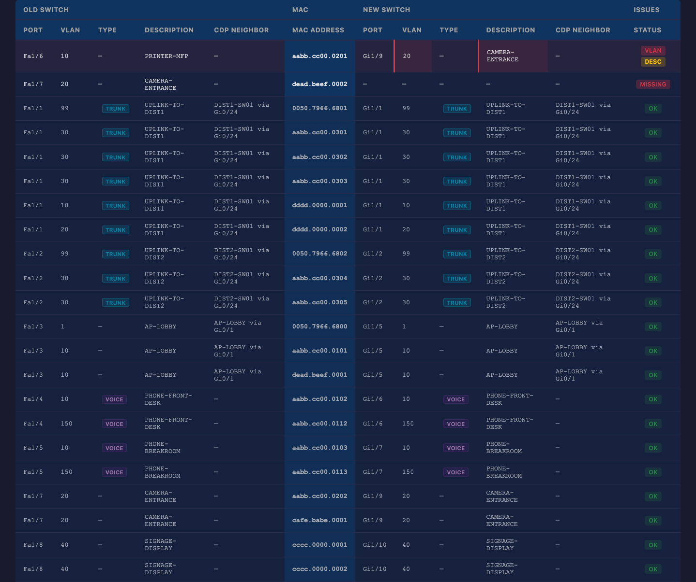

# TRMCompare

**Stop staring. Start comparing.**

TRMCompare is a client-side switch migration audit tool. Paste terminal output from your old and new switches, and instantly see every MAC address side-by-side with VLAN, port type, description, and CDP neighbor data — with mismatches highlighted.

No more eyeballing two terminal windows. No more "stare and compare" until your vision blurs. Paste, click, done.



## Why

Every network engineer has been there: you've swapped a switch, moved the cables, and now something doesn't work. A printer landed on the wrong VLAN. A camera port got plugged into a phone port. A trunk lost a device.

The old workflow: open two terminal windows, run `show mac address-table` on both, and stare at them until you spot the difference. On a 48-port switch, that's hundreds of lines of MAC addresses across dozens of VLANs.

TRMCompare does the staring for you. One line per MAC address. Old switch on the left, new switch on the right. Mismatches flagged in red. Filter to issues only. Export to Excel for documentation. Move on with your day.

## Features

- **Multi-command paste** — Paste full terminal output including `show mac address-table`, `show interfaces description`, `show cdp neighbors`, and `show vlan`. The tool auto-detects and parses each command.
- **Side-by-side audit** — One row per MAC address. Old switch data on the left, new switch data on the right. MAC address anchored in the center.
- **Mismatch detection** — VLAN changes, port type changes (access/trunk/voice), description mismatches, and CDP neighbor changes are flagged with color-coded badges.
- **Layered port classification** — Trunk/Voice/Access detection uses MAC table heuristics, `show vlan` definitive data, and CDP neighbor confirmation for maximum accuracy.
- **Sortable columns** — Click any column header to sort. Sort by old port, new VLAN, description, CDP neighbor, or issues.
- **Filter pills** — Toggle Trunk, Voice, Access, New, Missing. Click "Issues Only" to hide all OK rows and focus on problems.
- **Text search** — Type in the filter box to search across all columns.
- **Excel + PDF export** — One-click export for documentation and handoff.
- **100% client-side** — Your data never leaves your browser. No server, no account, no telemetry.

## Quick Start

### Use it now

Visit **[TRMCompare on GitHub Pages](https://lbruton.github.io/TRMCompare/)** and start pasting.

### Run locally

```bash
git clone https://github.com/lbruton/TRMCompare.git
cd TRMCompare
python3 -m http.server 8080
# Open http://localhost:8080
```

ES modules require HTTP serving — `file://` won't work due to CORS.

## How It Works

### 1. Capture

Run these commands on both switches (old and new):

```
show mac address-table
show interfaces description
show cdp neighbors
show vlan
```

Only `show mac address-table` is required. The other commands add enrichment data (descriptions, CDP neighbors, VLAN names, definitive trunk/access classification).

### 2. Paste

Copy the full terminal output (from the `hostname#` prompt to the end) into the Old Switch and New Switch panels. The tool handles multi-command output automatically.

### 3. Compare

Click **Compare**. The audit table shows one row per MAC address:

| Old Switch | MAC | New Switch | Issues |
|:---:|:---:|:---:|:---:|
| Port, VLAN, Type, Desc, CDP | `aabb.cc00.0201` | Port, VLAN, Type, Desc, CDP | VLAN, DESC |

Mismatched cells are highlighted. Filter to "Issues Only" to focus on problems.

## Supported Platforms

- **Cisco IOS** — Catalyst 2960, 3560, 3750, IE-3000
- **Cisco IOS-XE** — Catalyst 9200, 9300, IE-3300
- **Cisco NX-OS** — Nexus 3k, 5k, 7k, 9k

## Sample Data

The `samples/` directory contains example switch output for testing:

- `before-ie3000.txt` — IE-3000 (FastEthernet) with phones, cameras, printer, signage, trunk uplinks
- `after-ie3300.txt` — IE-3300 (GigabitEthernet) after migration with a mispatched printer and missing camera

## Tech Stack

Zero dependencies. Zero build steps. Zero telemetry.

- Vanilla HTML, CSS, JavaScript (ES modules)
- [SheetJS](https://sheetjs.com/) for Excel export (bundled)
- [jsPDF](https://github.com/parallax/jsPDF) + [AutoTable](https://github.com/simonbengtsson/jsPDF-AutoTable) for PDF export (bundled)

## License

MIT
